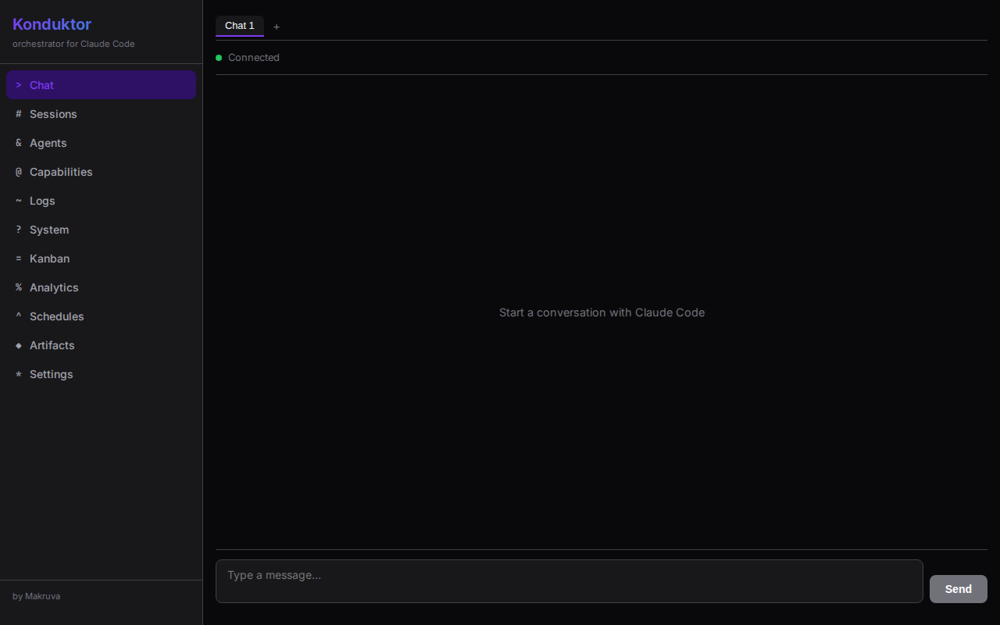
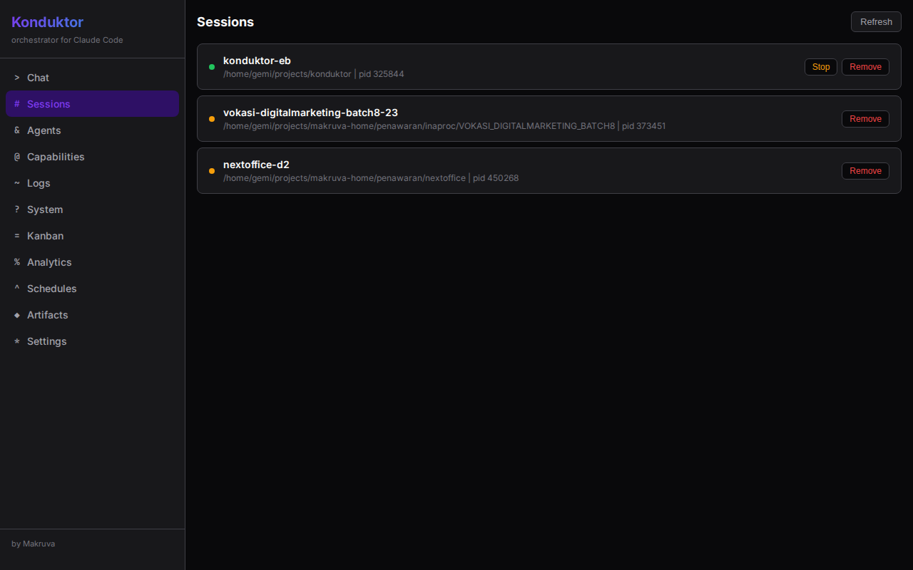
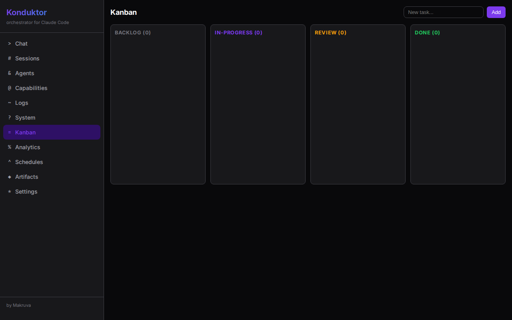
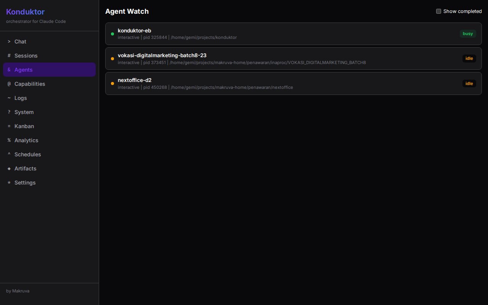
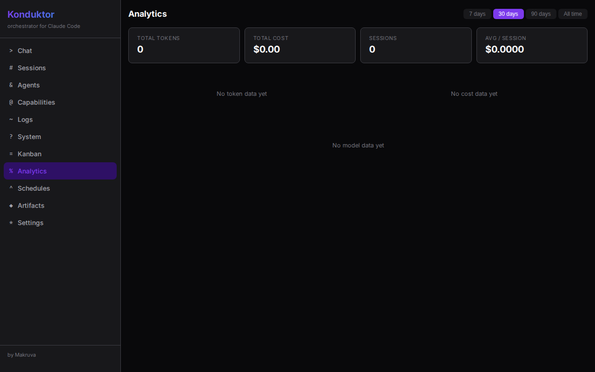
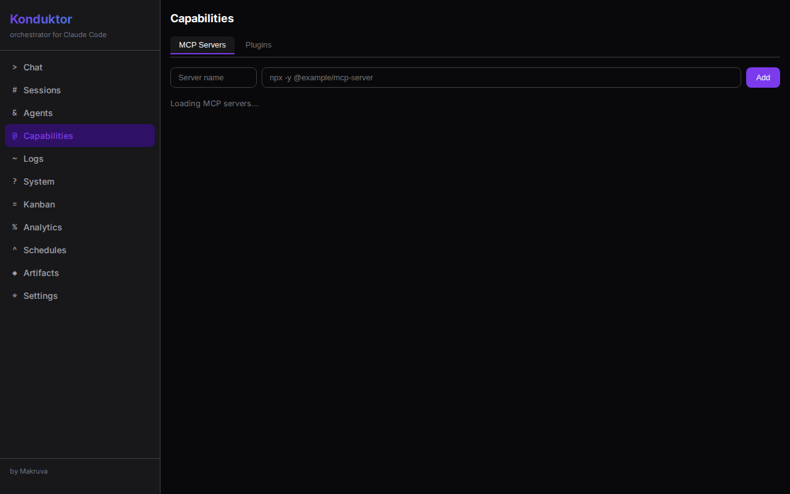
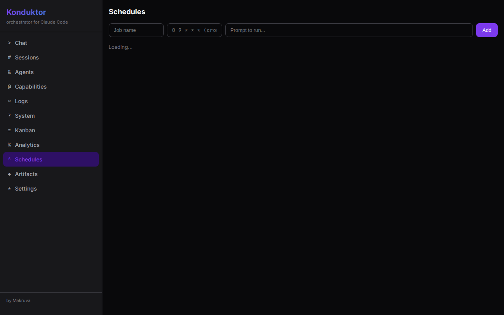
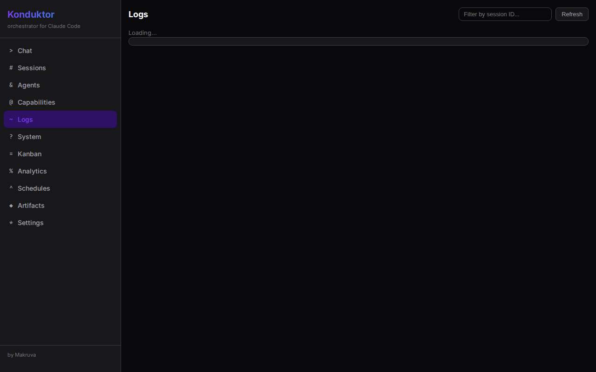
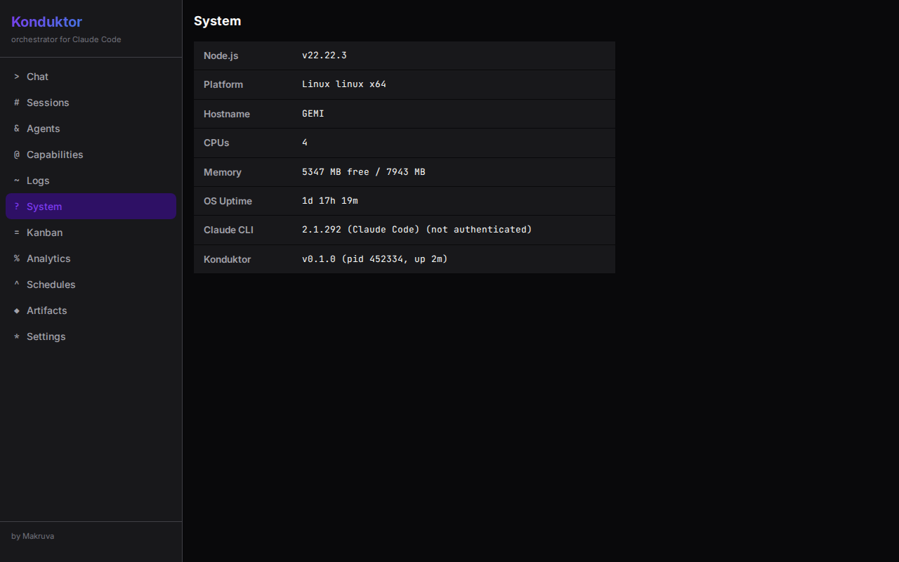

# Konduktor

[](https://github.com/gemimakruva/konduktor/actions/workflows/ci.yml)
[](LICENSE)
[](https://nodejs.org/)

Open-source orchestrator for Claude Code. No hacks. No bots. No ToS violations.

> Powered by your Claude Code CLI subscription. Legal. Open-source. MIT licensed.

## What is Konduktor?

Konduktor is a web dashboard that wraps the official Claude Code CLI, giving you a visual interface for orchestrating AI-powered development workflows — all within Anthropic's Terms of Service.

## Features

**Chat & Sessions**
- Streaming chat interface with real-time output
- Multi-tab sessions with independent conversations
- Thinking block visualization (collapsible)
- Tool use visualization (expandable inline cards with input/output)

**Orchestration**
- Kanban board for task management
- Subagent watch and monitoring
- Cron job scheduling with execution history
- Up to 10 concurrent sessions

**Data & Insights**
- Analytics dashboard with token usage and cost tracking
- Artifact gallery with tagging and preview
- Full-text search across sessions
- Data export (JSON/CSV)

**Settings & Security**
- Dark/light/system theme
- LAN access with PIN code authentication
- Desktop notifications for session and cron completion
- Dynamic capability discovery (MCP servers, plugins, skills)

## Screenshots

| Chat | Sessions | Kanban |
|------|----------|--------|
|  |  |  |

| Agents | Analytics | Settings |
|--------|-----------|----------|
|  |  |  |

<details>
<summary>More screenshots</summary>

| Capabilities | Schedules | Artifacts |
|--------------|-----------|-----------|
|  |  |  |

| Search | Export | Logs |
|--------|--------|------|
|  |  |  |

| System |
|--------|
|  |

</details>

## Quick Start

### Prerequisites

- [Node.js](https://nodejs.org/) >= 20
- [pnpm](https://pnpm.io/) >= 9
- [Claude Code CLI](https://docs.anthropic.com/en/docs/claude-code) installed and authenticated
- Active Claude subscription (Pro, Team, or Enterprise)

### Install & Run

```bash
git clone https://github.com/gemimakruva/konduktor.git
cd konduktor
pnpm install
pnpm build
pnpm start
```

This builds everything and opens Konduktor at **http://localhost:4170** in your browser.

See **[Getting Started](docs/getting-started.md)** for platform-specific instructions (macOS/Windows), shell shortcuts, and usage examples.

## Documentation

- **[Getting Started](docs/getting-started.md)** — installation, setup, and complete feature walkthrough
- **[Contributing](CONTRIBUTING.md)** — development setup and contribution guidelines
- **[Changelog](CHANGELOG.md)** — release history

## Architecture

```
packages/
  shared/    @konduktor/shared   — types and constants
  server/    @konduktor/server   — Express 5 + WebSocket + SQLite
  client/    @konduktor/client   — React 19 + Vite
  cli/       @konduktor/cli      — CLI entry (start/stop/status)
```

| Component | Stack |
|-----------|-------|
| Backend | Express 5, TypeScript 5.5, better-sqlite3, ws, node-cron |
| Frontend | React 19, Vite, Recharts |
| CLI | Node.js, commander |
| Tests | Vitest (117 tests) |

## Development

```bash
pnpm install     # install dependencies
pnpm dev         # start all packages in dev mode
pnpm build       # build all packages
pnpm test        # run all tests
```

## Roadmap

- [x] Phase 1: Foundation — chat, sessions, settings, theme
- [x] Phase 2: Orchestration — kanban, agents, capabilities, search
- [x] Phase 3: Automation & Analytics — cron, analytics, artifacts, export
- [x] Phase 4: Advanced Features — thinking blocks, tool visualization, notifications
- [ ] Phase 5: npm publish, docs site, community templates

## License

MIT — [PT Makruva Teknologi Nusantara](https://makruva.com)
